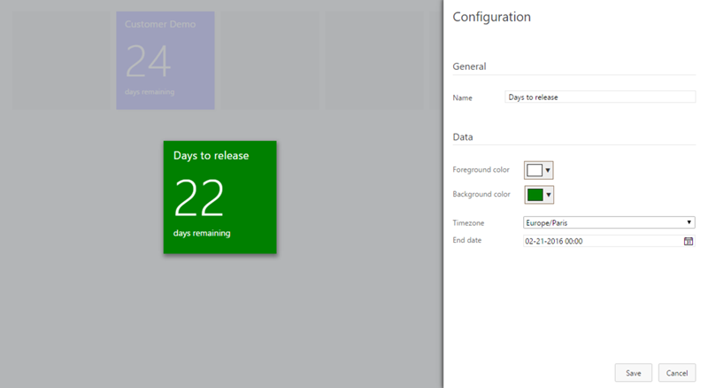

## Show countdown counters for your team's important events ##

Every team has important dates to remember. Make them visible for your team by adding countdown tiles to your dashboard!

### Countdown widget ###

The countdown widget can be added for all the events you want to highlight on the dashboard. Use different colors to make them easier to recognize for the team.

You can customize the name of the tile, set the colors and of course set the moment in time it represents. 

### Sprint end countdown widget ###
This simplified version of the widget shows the remaining time for the current iteration. Use the configuration pane to configure the title and tile colors.

## Learn more

> Microsoft DevLabs is an outlet for experiments from Microsoft, experiments that represent some of the latest ideas around developer tools. Solutions in this category are designed for broad usage, and you are encouraged to use and provide feedback on them; however, these extensions are not supported nor are any commitments made as to their longevity.

[View Notices](https://marketplace.visualstudio.com/_apis/public/gallery/publisher/ms-devlabs/extension/CountdownWidget/latest/assetbyname/ThirdPartyNotices.txt) for third party software included in this extension.

## Contributors

We thank the following contributor(s) for this widget: Mathias Olausson, Mikael Krief, and Wouter de Kort. 

## Feedback

We need your feedback! Here are some ways to connect with us:

- Add a comment in the Q&A section below and please add an actionable review.
- Send us an [email](mailto://mktdevlabs@microsoft.com).

Review the [list of features and resolved issues of latest tools and extensions](https://aka.ms/vsarreleases) for information on the latest releases.