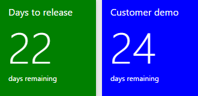
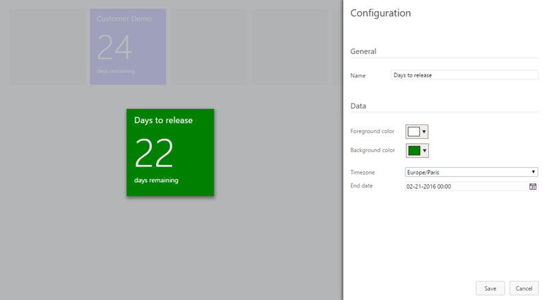
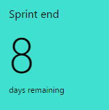

# Show countdown counters for your team's important events ##

Every team has important dates to remember. Make them visible for your team by adding countdown tiles to your dashboard!

>  Interested how our CI/CD pipeline works? Read [Set up a CI/CD pipeline with unit testing and code coverage for your Team Services extension](https://blogs.msdn.microsoft.com/visualstudioalmrangers/2017/04/24/set-up-a-cicd-pipeline-with-unit-testing-and-code-coverage-for-your-team-services-extension/) to learn more. 

## Countdown widget

The countdown widget can be added for all the events you want to highlight on the dashboard. Use different colors  to make them easier to recognize for the team.

You can customize the name of the tile, set the colors and of course set the moment in time it represents. 

## Sprint end countdown widget
This simplified version of the widget shows the remaining time for the current iteration. Use the configuration pane to configure the title and tile colors.

## Prerequisites

- Team Foundation Team Services
- Team Foundation Server 2015 Update 3 (or higher)

##Contributors

We thank the following contributor(s) for this widget: Mathias Olausson and Wouter de Kort. 

## Notices
Notices for certain third party software included in this solution are provided here: [Third Party Notice](ThirdPartyNotices.txt).

##Contribute
Contributions to Countdown Widget are welcome. Here is how you can contribute:  

- Submit bugs and help us verify fixes  
- Submit pull requests for bug fixes and features and discuss existing proposals   

Please refer to [Contribution guidelines](.github/CONTRIBUTING.md) and the [Code of Conduct](.github/COC.md) for more details.
